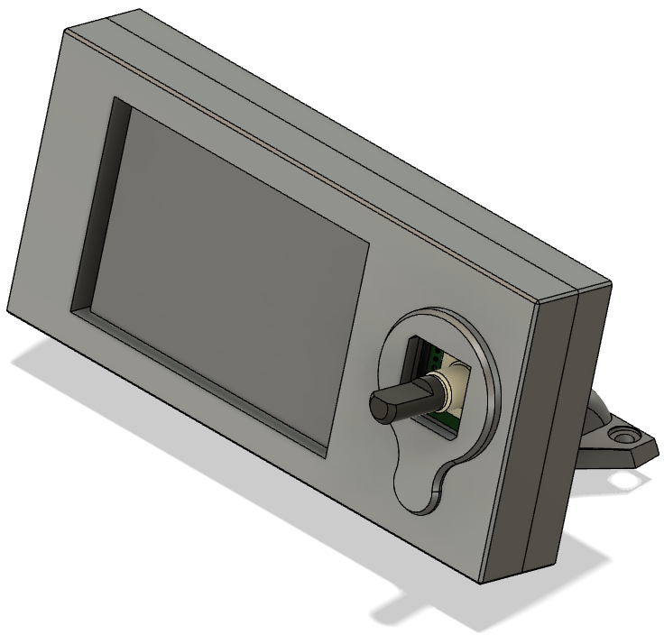

some mods of https://github.com/eamars/OpenTrickler

Rear Body Interface:
- easier to clean
- slide solution did not work for me
- powder volume reduction
- powder hopper is removeable for storage

Mini12864 mount:

PCB and power supply in shield:

