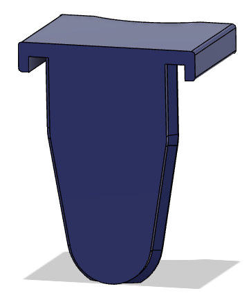

## some mods of https://github.com/eamars/OpenTrickler

### Rear Body Interface:
- easier to clean
- slide solution did not work for me
- powder volume reduction
- powder hopper is removeable for storage

### Front Cover:
- easier to clean
- slide solution did not work for me

### Mini12864 mount:
- fixed place for the display
- within footprint of the trickler

### PCB and power supply in shield:
- PCB included in the shield
- power supply included in the shield
- all wires in the shield
- one power supply for trickler and scale (!!! 12V !!!)

